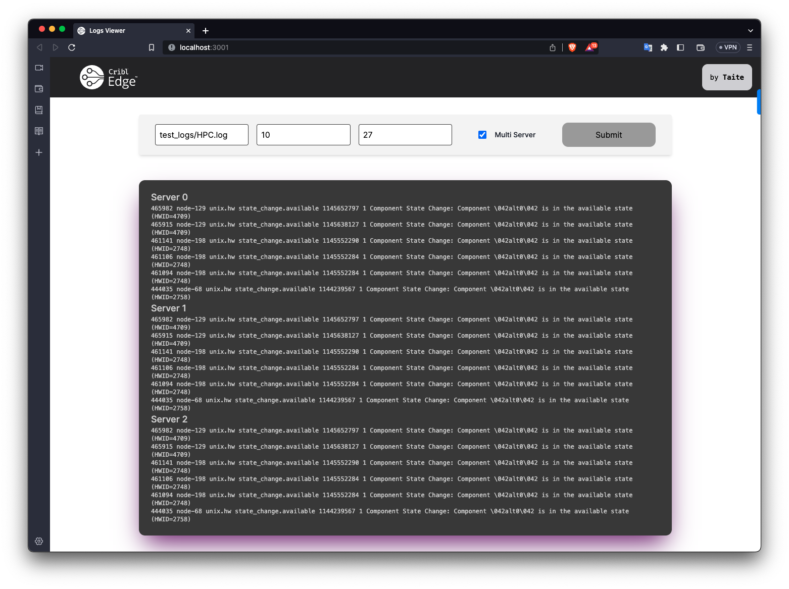

# Cribl Log Search

CLS is a log searching API that exposes one endpoint `/logs` that accepts a `filename`, `last`, and `keyword` query parameter. The `filename` is the name of the log file to search and the `last` parameter is the number of lines to return from the end of the file. `keyword` can be used to filter the results to only lines that contain the keyword.



## Implementation Notes

I use a chunking strategy to read lines from the end of the file upwards until either the number of lines requested is reached or the beginning of the file is reached. This is done by reading chunks of the file from the end and splitting the chunk into lines. The lines are then reversed and returned.

## Running the app

Install rustup and cargo: https://rustup.rs/

```bash
cargo run 8080 --release

curl "http://localhost:8080/logs?filename={logname}&last=10000000"
curl "http://localhost:8080/logs?filename={logname}&last={last_n_entries}&keyword={keyword}"
```

## Running the app's web interface

Install yarn: https://yarnpkg.com/getting-started/install

```bash
cd site && yarn install
cd ../
chmod +x ./start.sh && ./start.sh
```

This will run 4 API servers on ports 8080, 8081, 8082, and 8083, and the development server for the web interface will be available at http://localhost:3000 (if it isn't already taken).

You can test the multi-server API by running the following command:

```bash
curl "http://localhost:8080/multi-logs?filename={filename}&last={last_n_entries}&keyword={keyword}"
```

## Benchmarks

Tested on a M1 Pro Max with 32Gb of RAM.

Benchmarks made possible by log file supporters:
Shilin He, Jieming Zhu, Pinjia He, Michael R. Lyu. Loghub: A Large Collection of System Log Datasets towards Automated Log Analytics. Arxiv, 2020.

### HDFS.1 (Hadoop Distributed File System) 1.47GB

`curl "http://localhost:8080/logs?filename=test_logs/HDFS.log&last=10000000"`

| File Name | File Size | Lines Returned | Query Latency |
| --------- | --------- | -------------- | ------------- |
| HDFS.log  | 1504.88mb | 100            | 53.958µs      |
| HDFS.log  | 1504.88mb | 1000           | 610.875µs     |
| HDFS.log  | 1504.88mb | 10000          | 6.902167ms    |
| HDFS.log  | 1504.88mb | 100000         | 33.906584ms   |
| HDFS.log  | 1504.88mb | 1000000        | 204.017792ms  |
| HDFS.log  | 1504.88mb | 10000000       | 1.989568459s  |
| HDFS.log  | 1504.88mb | 11175630       | 2.256178333s  |

#### Concurrent requests

| File Name | File Size | Lines Returned | Concurrent Queries | Query Latency |
| --------- | --------- | -------------- | ------------------ | ------------- |
| HDFS.log  | 1504.88mb | 10000000       | 10                 | 2.005238875s  |
| HDFS.log  | 1504.88mb | 11175630       | 10                 | 2.389033292s  |

### HPC (High Performance Computing) 32.00MB

[`curl "http://localhost:8080/logs?filename=test_logs/HPC.log&last=10000000"`

| File Name | File Size | Lines Returned | Query Latency |
| --------- | --------- | -------------- | ------------- |
| HPC.log   | 31.99mb   | 100            | 56.75µs       |
| HPC.log   | 31.99mb   | 1000           | 291.708µs     |
| HPC.log   | 31.99mb   | 10000          | 6.599458ms    |
| HPC.log   | 31.99mb   | 100000         | 31.516458ms   |
| HPC.log   | 31.99mb   | 433490         | 69.21975ms    |

## TODO

Tests!

## Closing Thoughts

The chunking strategy could become more sophisticated using multithreading and a bit of preprocessing of the logfile.

With a more sophisticated chunking strategy, advancing the filtering method is another candidate for optimization. Currently, I am unable to filter loglines as we fill the buffer up as a chunk may be split upon a single line. In other words, two chunks may contain the same line. If we were able to chunk the file in a way where we could guarantee a chunk would only contain full lines, we could filter the lines as we read them in. Part of this solution involves buffering incomplete lines between chunks. This solution would allow us to filter the lines as we read them in, but would require a little more memory. I believe that tradeoff between memory and speed would be worth it.

The program currently spits out some metrics about its evaluation while running, which is useful for benchmarking those kinds of changes.
