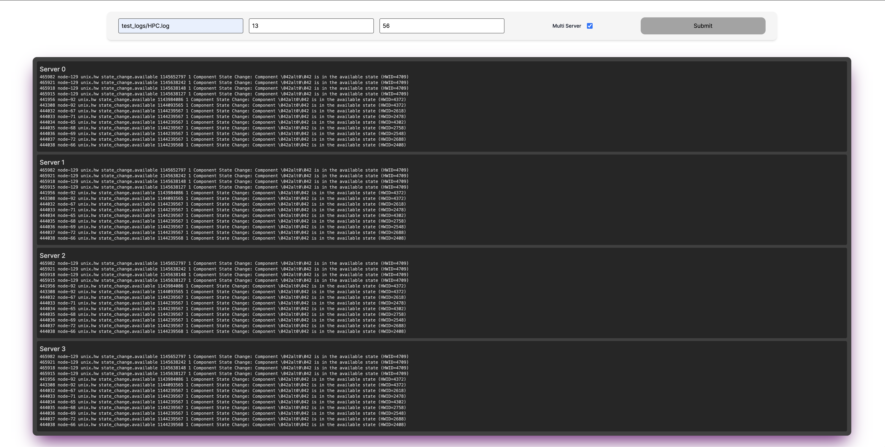

# Log Search

Search logs on a server (or multiple servers??), and do it remotely with a web interface! These two implementations in Rust and Typescript work a chunking strategy to iterate from the end of a log file to the beginning with query parameters to filter and list the last `n` lines of the filename you pass in.



## Running the rust-api

Install rustup and cargo: https://rustup.rs/

```bash
cd ./api/rust
cargo run 8080 --release

curl "http://localhost:8080/logs?filename={logname}&last=10000000"
curl "http://localhost:8080/logs?filename={logname}&last={last_n_entries}&keyword={keyword}"
```

## Running the node-api

```bash
cd ./api/node
yarn build
yarn start

curl "http://localhost:3001/logs?filename={logname}&last=10000000"
curl "http://localhost:3001/logs?filename={logname}&last={last_n_entries}&keyword={keyword}"
```

## Running the app's web interface

Install yarn: https://yarnpkg.com/getting-started/install

```bash
cd web
yarn install
yarn dev
```

## Running it all together

```bash
cd ./api/node
yarn build
cd ../../
cd web
yarn install
cd ../
yarn start
```

This will run 8 API servers in total on ports 8080, 8081, 8082, 8083, ports 3001, 3002, 3003, 3004, and the development server for the web interface will be available at http://localhost:3000 (if it isn't already taken). Feel free to change them. 

You can test the multi-server API by running the following command or using the web interface:

#### Rust

```bash
curl "http://localhost:8080/logs/multi?filename={filename}&last={last_n_entries}&keyword={keyword}"
```

#### Node

```bash
curl "http://localhost:3001/logs/multi?filename={filename}&last={last_n_entries}&keyword={keyword}"
```

## Rust Benchmarks

Tested on a M1 Pro Max with 32Gb of RAM.

Benchmarks made possible by log file supporters:
Shilin He, Jieming Zhu, Pinjia He, Michael R. Lyu. Loghub: A Large Collection of System Log Datasets towards Automated Log Analytics. Arxiv, 2020.

### HDFS.1 (Hadoop Distributed File System) 1.47GB

`curl "http://localhost:8080/logs?filename=test_logs/HDFS.log&last=10000000"`

| File Name | File Size | Lines Returned | Query Latency |
| --------- | --------- | -------------- | ------------- |
| HDFS.log  | 1504.88mb | 100            | 53.958µs      |
| HDFS.log  | 1504.88mb | 1000           | 610.875µs     |
| HDFS.log  | 1504.88mb | 10000          | 6.902167ms    |
| HDFS.log  | 1504.88mb | 100000         | 33.906584ms   |
| HDFS.log  | 1504.88mb | 1000000        | 204.017792ms  |
| HDFS.log  | 1504.88mb | 10000000       | 1.989568459s  |
| HDFS.log  | 1504.88mb | 11175630       | 2.256178333s  |

#### Concurrent requests

| File Name | File Size | Lines Returned | Concurrent Queries | Query Latency |
| --------- | --------- | -------------- | ------------------ | ------------- |
| HDFS.log  | 1504.88mb | 10000000       | 10                 | 2.005238875s  |
| HDFS.log  | 1504.88mb | 11175630       | 10                 | 2.389033292s  |

### HPC (High Performance Computing) 32.00MB

[`curl "http://localhost:8080/logs?filename=test_logs/HPC.log&last=10000000"`

| File Name | File Size | Lines Returned | Query Latency |
| --------- | --------- | -------------- | ------------- |
| HPC.log   | 31.99mb   | 100            | 56.75µs       |
| HPC.log   | 31.99mb   | 1000           | 291.708µs     |
| HPC.log   | 31.99mb   | 10000          | 6.599458ms    |
| HPC.log   | 31.99mb   | 100000         | 31.516458ms   |
| HPC.log   | 31.99mb   | 433490         | 69.21975ms    |

## Node Benchmarks

### HDFS.1 (Hadoop Distributed File System) 1.47GB

`curl "http://localhost:3001/logs?filename=test_logs/HDFS.log&last=10000000"`

| File Name | File Size | Lines Returned | Query Latency |
| --------- | --------- | -------------- | ------------- |
| HDFS.log  | 1504.88mb | 100            | 178µs         |
| HDFS.log  | 1504.88mb | 1000           | 533µs         |
| HDFS.log  | 1504.88mb | 10000          | 6.457ms       |
| HDFS.log  | 1504.88mb | 100000         | 37.659ms      |
| HDFS.log  | 1504.88mb | 1000000        | 241.47ms      |
| HDFS.log  | 1504.88mb | 10000000       | 2.425s        |
| HDFS.log  | 1504.88mb | 11175630       | 3.231s        |

#### Concurrent requests

For `last` values of `1000000`, `10000000`, and `11175630` lengths, the Node server ran out of memory and crashed shortly after outputting its read time.

### HPC (High Performance Computing) 32.00MB

[`curl "http://localhost:8080/logs?filename=test_logs/HPC.log&last=10000000"`

| File Name | File Size | Lines Returned | Query Latency |
| --------- | --------- | -------------- | ------------- |
| HPC.log   | 31.99mb   | 100            | 163µs         |
| HPC.log   | 31.99mb   | 1000           | 534µs         |
| HPC.log   | 31.99mb   | 10000          | 5.897ms       |
| HPC.log   | 31.99mb   | 100000         | 33.938ms      |
| HPC.log   | 31.99mb   | 433490         | 110.766ms     |

## Rust Vs Node

In order for Node.js to handle larger chunks of data, a streaming API might be necessary. Currently the Node API fails after ~600mb of data is queried for. The Rust API can handle the maximum test of 1.5gb. A streaming API would help the Node implementation handle the communication of chunks to the frontend and might allow it to surpass my trivial Rust server in some instances. RxJS might be a good candidate for this. A simple Observable / Observer model with this chunking strategy could improve the memory usage greatly — most all performance gains in Javascript come from less memory usage. 

## Future Improvements

- Tests!

- File perms: Add error handling to catch permission-related errors for requested files.

- Writing while reading: Logs are often written to while being read. May want to handle a couple scenarios where the log is being written to while the program reads it by applying a mutex lock to the file.

- Large 'last' Parameter: Add a reasonable `max` limit to avoid large requests that could cause the server to run out of memory.

- Binary Files: Maybe consider checking file types before reading them if the log files contain non-UTF8 characters or binary data.

- Pagination: If the logs are large, or a large `last` parameter is provided, returning all loglines at once isn't feasible. Pagination would allow clients to request logs in batches.

- Time Range: If log entries are timestamped and users are interested, adding support for a query span might be interesting.

- Level Filter: Sometimes loglines have severity levels (ERROR, WARN, INFO, DEBUG, etc.) that users might want to explicitly query for.

- Live Streaming: For real-time applications, users might want the ability for clients to "subscribe" to a log file and get updates in real time, as logs are written to the log.

- Text Search: Instead of just keyword matching, users might want to search for logs that match a certain regular expression, or use boolean operators to combine different search terms.

- Sorting: It could be useful to sort log entries by various fields, like timestamp, severity level, etc.

- Tagging: Users might want to tag certain log entries and query for logs that have been tagged with a certain tag.
